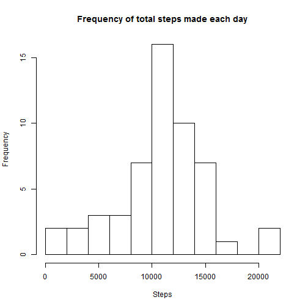
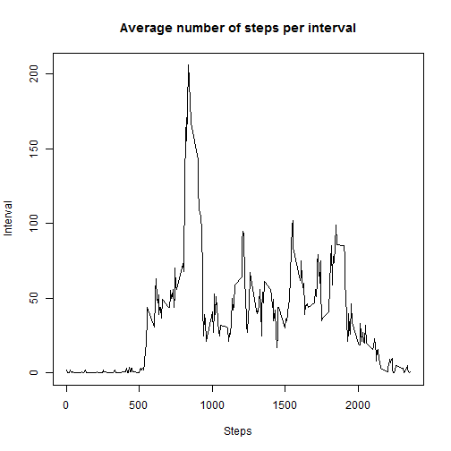
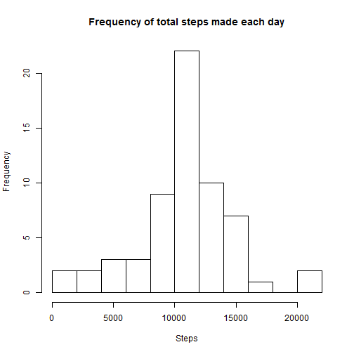
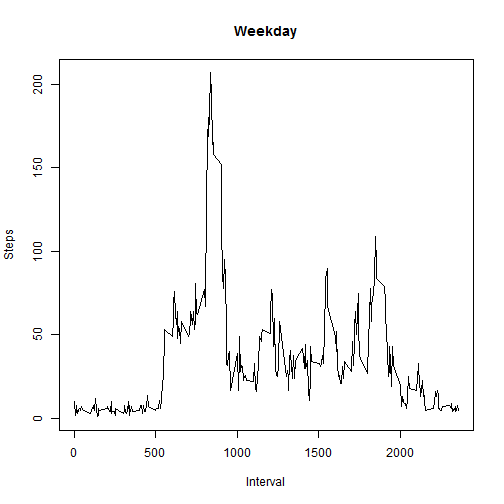
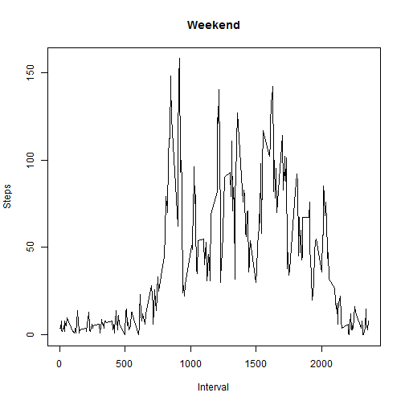

opts_chunk$set(cache=TRUE, cache.path = 'cache/', fig.path='figure/')

---
title: "Reproducible Research - Peer Assessment 1"
author: "Tomasz Jacek Rydzewski"
date: "Thursday, August 14, 2014"
output:
  html_document:
    keep_md: yes
---

Introduction
============
It is now possible to collect a large amount of data about personal movement 
using activity monitoring devices such as a Fitbit, Nike Fuelband, or Jawbone 
Up.These type of devices are part of the “quantified self” movement – a group of
enthusiasts who take measurements about themselves regularly to improve their 
health, to find patterns in their behavior, or because they are tech geeks. But 
these data remain under-utilized both because the raw data are hard to obtain 
and there is a lack of statistical methods and software for processing and 
interpreting the data.

This assignment makes use of data from a personal activity monitoring device. 
This device collects data at 5 minute intervals through out the day. The data 
used for analysis consists of two months of data from an anonymous individual 
collected during the months of October and November, 2012 and include the number
of steps taken in 5 minute intervals each day.

Analysis
========
Loading and preprocessing the data
----------------------------------
The very first step of every analysis is data load and processing. Not different
this time, following code unzips the archive the data set has been provided in,
and while processing it as CSV stores in a data frame `df`


```r
unzip('activity.zip')
df = read.csv('activity.csv', header=TRUE, sep=',', quote='"', 
              colClasses=c('numeric', 'Date', 'numeric'), na.strings='NA')
colnames(df) = c('Steps', 'Date', 'Interval')
```

Mean number of steps
--------------------
An interesting number is number of steps made by the subject each day and its
mean and media across whole subset.

At the moment for simplification we are going to **skip all unknown numbers**.

Lets first sum up all steps for each day and see the histogram.

```r
stepsPerDay = df[,c('Date', 'Steps')]
stepsPerDay = aggregate(. ~ Date, data=stepsPerDay, FUN=sum, na.action=na.omit)
```


```r
hist(stepsPerDay$Steps, breaks=10, xlab='Steps', 
     main='Frequency of total steps made each day')
```

 

As we can see the most freuqent number is around 10000-12000. Lets see how does 
it match mean and median of total number of steps taken per day.

Following code calulcates those firues. And as shown below our assumption based
on the graph matches the mean and median.


```r
stepsMeanPerDay = mean(stepsPerDay$Steps)
stepsMedianPerDay = median(stepsPerDay$Steps)
```

*Mean:* 10766.1886792453

*Median:* 10765

Average daily activity pattern
------------------------------
Another interesting number is an average daily activity pattern - number of 
steps taken across the day per interval. Following code calcualates the number
and the graph presents it.


```r
averagePerInterval = df[,c('Interval', 'Steps')]
averagePerInterval = aggregate(. ~ Interval, data=averagePerInterval, FUN=mean, 
                               na.action=na.omit)
averagePerInterval$Steps = round(averagePerInterval$Steps)
```


```r
plot(averagePerInterval$Interval, averagePerInterval$Steps, type='l', 
     xlab='Steps', ylab='Interval', main='Average number of steps per interval')
```

 

As we can see we have a spike of steps taken.


```r
stepsMax = averagePerInterval[which.max(averagePerInterval$Steps),]
```

At 835 hours on average, during the day the subject took 
206 steps, which is the, on average, the highest number of steps
druing the day.

Missing values
--------------
It's time to verify if the data set contains any missing values.


```r
sum(is.na(df$Steps))
```

[1] 2304

Unfortunatelly the data set contains missing values. To minimize the bias in the 
analysis, lets fill in missing value. *The strategy will be to use random sample
from calculated averages steps taken during the day per interval.* Following 
code shows how this have been achieved (new data frame is stored in `dfNoNA`)


```r
dfNoNA = df[is.na(df$Steps),]
dfNoNA$Steps = sample(averagePerInterval$Steps, length(dfNoNA$Date), 
                      replace=TRUE)
dfNoNA = rbind(df[!is.na(df$Steps),], dfNoNA)
```

And how does it compare to the previous analysis?


```r
stepsPerDayNoNA = dfNoNA[,c('Date', 'Steps')]
stepsPerDayNoNA = aggregate(. ~ Date, data=stepsPerDayNoNA, FUN=sum,
                            na.action=na.omit)
```

```r
hist(stepsPerDayNoNA$Steps, breaks=10, xlab='Steps', 
     main='Frequency of total steps made each day')
```

 

It seems that imputing missin values and using random sample has increaed the 
frequency of average steps per day, but to make sure lets calcualte the mean and
media.


```r
stepsMeanPerDayNoNA = mean(stepsPerDayNoNA$Steps)
stepsMedianPerDayNoNA = median(stepsPerDayNoNA$Steps)
```

*Mean:* 10732.9016393443

*Median:* 10641

Weekday vs Weekend
------------------
The last analysis is comparison of weekend and weekday patterns of average steps
taken during the day per interval.

First lets introduce weekday/weekend factor to the set with imputed NA values.


```r
dfNoNA$Day = ifelse(weekdays(dfNoNA$Date) %in% c('Saturday', 'Sunday'), 
                    'weekend', 'weekday')
dfNoNA$Day = as.factor(dfNoNA$Day)
```

Calculate the mean per interval for weekend.

```r
averagePerIntervalOnWeekend = dfNoNA[dfNoNA$Day == 'weekend', 
                                     c('Interval', 'Steps')]
averagePerIntervalOnWeekend = aggregate(. ~ Interval,
                                        data=averagePerIntervalOnWeekend,
                                        FUN=mean)
averagePerIntervalOnWeekend$Steps = round(averagePerIntervalOnWeekend$Steps)
```

And for weekday.

```r
averagePerIntervalOnWeekday = dfNoNA[dfNoNA$Day == 'weekday',
                                     c('Interval', 'Steps')]
averagePerIntervalOnWeekday = aggregate(. ~ Interval,
                                        data=averagePerIntervalOnWeekday,
                                        FUN=mean)
averagePerIntervalOnWeekday$Steps = round(averagePerIntervalOnWeekday$Steps)
```

Following diagram displays results.


```r
with(df, {
  plot(averagePerIntervalOnWeekday$Interval, averagePerIntervalOnWeekday$Steps, 
       type='l', main='Weekday', ylab='Steps', xlab='Interval')
  plot(averagePerIntervalOnWeekend$Interval, averagePerIntervalOnWeekend$Steps, 
       type='l', main='Weekend', ylab='Steps', xlab='Interval')
})
```

  

Conclusion
==========
As we can see the subject is a really active person, we can speculate that 
between 8 and 10 o'clock he is most probably running every day and while he 
might have sitting work, he defintelly does not spend weekend on fron of the TV.
